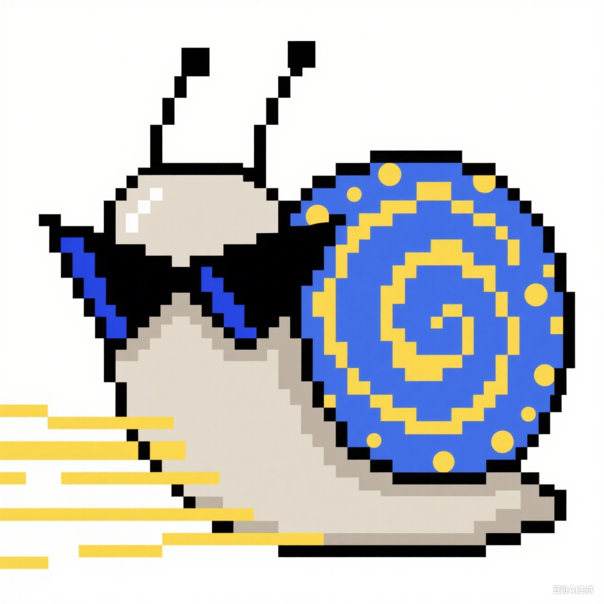

<div align="center">
  
  
  # 🐌 蜗牛待办 (Snail TodoList)
  
  <p align="center">
    <strong>一个完全由 AI 驱动开发的现代化待办事项管理应用</strong>
  </p>
  
  <p align="center">
    
    
  </p>
  
  <p align="center">
    
    
    
    
    
    
  </p>
</div>

## 🤖 AI 驱动的 Vibe Coding 产物

这是一个**完全由人工智能生成**的项目，展示了 AI 驱动开发的强大能力：

- 🎯 **100% AI 生成**: 没有任何人工编写的代码，完全通过 AI 对话生成
- 🧠 **Vibe Coding**: 通过自然语言描述和需求对话，让 AI 理解并实现功能
- 🔧 **Cursor + Claude Code**: 主要开发工具，提供智能代码生成和项目管理
- ⚡ **快速迭代**: 从概念到完整应用，展示 AI 辅助开发的高效性

### 🛠️ 开发工具链

- **主要 IDE**: [Cursor](https://cursor.sh/) - AI 原生代码编辑器
- **AI 助手**: [Claude Code](https://claude.ai/code) - Anthropic 的编程专用 AI
- **开发方式**: Vibe Coding - 通过自然语言对话驱动代码生成
- **设计理念**: AI-First Development - 让 AI 理解需求并自主实现

一个现代化、功能丰富的待办事项管理应用，支持项目分组、任务排序、协作共享等功能。

## 📸 应用预览

<div align="center">
  
  <p><em>蜗牛待办主界面 - 展示项目管理、任务编辑和富文本支持功能</em></p>
</div>

## ✨ 特性

- 📝 **智能任务管理** - 创建、编辑、完成、放弃任务
- 🗂️ **项目分组** - 灵活的项目管理和任务分类
- 📅 **日期管理** - 支持任务截止日期和时间视图
- 🔄 **拖拽排序** - 直观的任务优先级调整
- 👥 **协作共享** - 项目共享和多人协作
- 📱 **响应式设计** - 完美适配桌面和移动设备
- 🌙 **深色模式** - 支持明暗主题切换
- 🔍 **高级搜索** - 全文搜索和筛选功能
- 🗃️ **存档管理** - 已完成和已放弃任务的分类管理
- 📊 **数据统计** - 任务完成统计和趋势分析

## 🚀 快速开始

### 环境要求

- Node.js 18+ 
- npm 或 yarn
- Supabase 账户（用于后端数据库）

### 安装步骤

1. **克隆项目**
```bash
git clone https://github.com/wuuJiawei/snail-todolist.git
cd snail-todolist
```

2. **安装依赖**
```bash
npm install
```

3. **配置环境变量**
```bash
cp .env.example .env
```

编辑 `.env` 文件，填入你的 Supabase 配置：
```env
VITE_SUPABASE_URL=your_supabase_url_here
VITE_SUPABASE_ANON_KEY=your_supabase_anon_key_here
```

4. **设置数据库**

参考 [数据库设置指南](./docs/SETUP.md) 完成 Supabase 配置

5. **启动开发服务器**
```bash
npm run dev
```

应用将在 `http://localhost:5173` 启动

## 🏗️ 技术栈

- **前端框架**: React 18 + TypeScript
- **构建工具**: Vite
- **UI 组件**: shadcn/ui + Radix UI
- **样式**: Tailwind CSS
- **状态管理**: React Context + Custom Hooks
- **路由**: React Router
- **后端**: Supabase (PostgreSQL + 实时订阅 + 认证)
- **部署**: Vercel

## 📁 项目结构

```
src/
├── components/          # 可复用组件
│   ├── ui/             # 基础 UI 组件
│   ├── tasks/          # 任务相关组件
│   ├── settings/       # 设置页面组件
│   └── projects/       # 项目管理组件
├── contexts/           # React Context 状态管理
├── hooks/              # 自定义 React Hooks
├── services/           # API 服务层
├── types/              # TypeScript 类型定义
├── utils/              # 工具函数
├── constants/          # 常量定义
└── integrations/       # 第三方服务集成
```

## 🎯 核心功能

### 任务管理
- ✅ 创建、编辑、完成任务
- 📅 设置截止日期
- 🏷️ 项目分类
- 🗑️ 任务放弃和恢复
- 🔄 拖拽排序

### 项目协作
- 👥 项目共享
- 🔗 邀请链接生成
- 👤 成员权限管理

### 数据统计
- 📊 完成率统计
- 📈 任务趋势分析
- 📋 项目统计概览

### 用户体验
- 🌙 深色/浅色主题
- 📱 响应式设计
- 🔍 实时搜索
- ⚡ 离线支持

## 🚀 部署

### Vercel 部署（推荐）

1. Fork 此项目到你的 GitHub
2. 在 [Vercel](https://vercel.com) 中导入项目
3. **重要**: 设置环境变量
   - 进入项目 Settings → Environment Variables
   - 添加 `VITE_SUPABASE_URL` = 你的 Supabase 项目 URL
   - 添加 `VITE_SUPABASE_ANON_KEY` = 你的 Supabase anon key
   - 确保选择 Production, Preview, Development 环境
4. 部署完成

⚠️ **常见错误**: 如果看到 "Missing VITE_SUPABASE_URL" 错误，说明步骤3的环境变量没有正确设置

### 桌面客户端安装说明

#### macOS 安全性提示

如果在 macOS 上安装后遇到 **"应用已损坏，无法打开"** 的提示，这是因为 macOS 的 Gatekeeper 安全机制阻止了未签名应用的运行。解决方法：

1. 打开终端 (Terminal)
2. 输入以下命令并回车：
   ```bash
   xattr -cr "/Applications/Snail TodoList.app"
   ```
   或者如果安装在其他位置，请替换为实际路径：
   ```bash
   xattr -cr "应用实际路径/Snail TodoList.app"
   ```
3. 再次尝试打开应用

> **说明**：此命令移除了应用的隔离属性标志，允许 macOS 运行未签名的应用。这是安全的，只要您确保从可信来源下载了应用。

#### Windows 安全提示

如果 Windows Defender 或其他安全软件阻止应用运行，您可以：

1. 点击"更多信息"
2. 选择"仍要运行"
3. 将应用添加到安全软件的白名单中

### 其他平台

支持任何静态网站托管平台：
- Netlify
- GitHub Pages
- CloudFlare Pages
- 自建服务器

## 🤝 贡献

欢迎贡献代码！请查看 [贡献指南](./CONTRIBUTING.md)

1. Fork 项目
2. 创建功能分支 (`git checkout -b feature/AmazingFeature`)
3. 提交更改 (`git commit -m 'Add some AmazingFeature'`)
4. 推送分支 (`git push origin feature/AmazingFeature`)
5. 创建 Pull Request

## 📝 许可证

本项目采用 MIT 许可证 - 查看 [LICENSE](./LICENSE) 文件了解详情

## 🎨 设计理念

蜗牛待办采用"慢工出细活"的设计理念：
- 🐌 **专注当下** - 避免过度规划，专注当前任务
- 🌱 **渐进改进** - 支持任务的迭代优化
- 🎯 **简约高效** - 界面简洁但功能强大
- 🤝 **协作友好** - 支持团队协作和知识共享

## 🤖 AI 开发历程

这个项目完全通过 AI 驱动的 Vibe Coding 方式开发，展现了人工智能在软件开发领域的巨大潜力：

### 开发过程
1. **需求对话**: 通过自然语言描述功能需求
2. **AI 理解**: Claude Code 理解并规划技术实现
3. **代码生成**: 自动生成完整的组件、服务和配置
4. **迭代优化**: 通过对话持续改进和新增功能
5. **部署配置**: AI 自动配置 CI/CD 和生产环境

### 技术亮点
- 🏗️ **完整架构设计**: 从前端到后端的全栈架构
- 🔒 **安全最佳实践**: 自动集成安全配置和环境变量管理
- 📱 **响应式设计**: 自适应各种设备的现代化 UI
- 🚀 **性能优化**: 代码分割、懒加载等性能优化策略
- 🧪 **质量保证**: 类型安全、错误处理和用户体验优化

这证明了 AI 不仅能写代码，更能进行系统性的软件工程思考和实践。

## 📞 联系

- 项目主页: [GitHub Repository](https://github.com/wuuJiawei/snail-todolist)
- 问题反馈: [Issues](https://github.com/wuuJiawei/snail-todolist/issues)
- 功能建议: [Discussions](https://github.com/wuuJiawei/snail-todolist/discussions)

---

⭐ 如果这个项目对你有帮助，请给个 Star 支持一下！