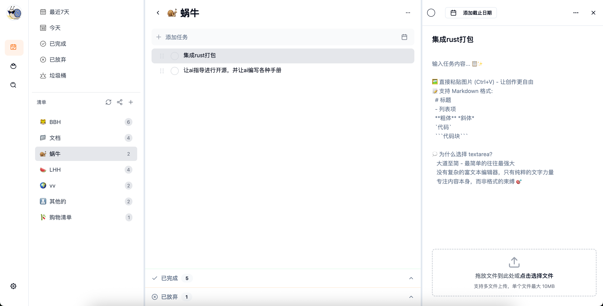

<p align="center">
  
</p>

<h1 align="center">🐌 Snail TodoList</h1>

<p align="center">
  一款面向个人与小团队的轻量任务管理应用，在保持界面简洁的同时，提供清单、标签、富文本、打卡、番茄钟和数据备份等完整能力。
</p>



## 为什么使用 Snail TodoList？

1. **功能完整但不过度复杂**：覆盖任务整理、日期规划、标签、搜索和专注记录，不引入臃肿的企业工作流。
2. **数据由自己的 Supabase 承载**：认证、PostgreSQL、Storage 和 Realtime 均连接到你配置的 Supabase 项目。
3. **备份与迁移可控**：可以随时将清单、任务、标签及关联关系导出为 ZIP，并支持合并或替换导入。
4. **便于继续扩展**：业务代码通过 Repository 和 Data Provider 访问数据，后续接入自部署后端无需修改页面和核心业务。
5. **多端一致**：支持响应式 Web、Vercel 部署和 Tauri 桌面客户端。

---

## ✨ 功能特点

### 任务与清单

- 创建、编辑、完成、取消完成、放弃、恢复和删除任务
- 垃圾桶保留与恢复，降低误删风险
- 使用清单组织任务，支持清单共享与成员管理
- 任务和清单拖拽排序
- “今天”“最近 7 天”“标记”“已完成”“已放弃”等快捷视图
- 按日期、清单和状态筛选任务

### 标签、搜索与内容

- 标签创建、管理、跨清单复用及任务关联
- 按任务标题、描述和清单进行搜索
- Milkdown Markdown 富文本编辑
- 图片、文件等任务附件上传与预览
- 任务动态记录与 Markdown 复制

### 习惯与专注

- 每日打卡、连续天数和历史记录
- 专注、短休、长休三种番茄钟模式
- 番茄会话标题、历史记录和统计
- 截止日期与提醒设置

### 账户与体验

- Supabase 邮箱注册、登录、退出和会话恢复
- GitHub、Google OAuth 登录入口
- 深色与浅色主题
- 桌面端和移动端响应式布局
- Web、Vercel 和 Tauri 桌面客户端支持

### 数据导入导出

- 将清单、任务、标签和任务—标签关系导出为 ZIP
- 支持“合并”和“替换”两种导入方式
- 导入导出过程显示实时进度
- 所有操作仅针对当前登录的 Supabase 账户

> 当前版本仅保留 Supabase 数据实现，不再提供 IndexedDB 离线用户、离线会话或在线/离线模式切换。

---

## 🧱 技术栈

| 分类 | 使用技术 |
| --- | --- |
| 前端框架 | React 18 · TypeScript |
| 构建与测试 | Vite · Vitest · ESLint |
| UI 体系 | shadcn/ui · Radix UI · Tailwind CSS |
| 路由与表单 | React Router 6 · React Hook Form |
| 服务端状态 | TanStack Query |
| 客户端状态 | Zustand · React Context |
| 后端服务 | Supabase PostgreSQL · Auth · Storage · Realtime |
| 富文本与代码编辑 | Milkdown · CodeMirror |
| 日期与图表 | date-fns · react-day-picker · Recharts |
| 拖拽与压缩 | @hello-pangea/dnd · JSZip |
| 桌面客户端 | Tauri 2 |

---

## 数据访问架构

组件、Context、Store 和业务 Hook 不直接调用 Supabase SDK：

```text
Component
  ↓
Hook / Query / UseCase
  ↓
Repository Interface
  ↓
Supabase Repository
  ↓
Supabase SDK
```

当前 Provider 状态：

- `supabase`：已实现并作为默认数据实现，不需要设置 `VITE_DATA_PROVIDER`
- `self-host`：保留规划值，尚未实现

后续接入自部署后端时，只需实现 `src/data/contracts` 中的 Repository 接口、组装 Provider，并将 `VITE_DATA_PROVIDER` 改为 `self-host`。页面、组件和核心业务代码无需修改。

## 📁 项目结构

```text
src/
├── components/              # 任务、清单、设置、打卡等 UI
├── contexts/                # 必要的 Provider 生命周期和业务操作
├── data/
│   ├── contracts/           # Repository 接口与统一错误
│   ├── providers/supabase/  # Supabase client、mapper 和 Repository 实现
│   ├── createDataProvider.ts
│   ├── dataProvider.ts
│   └── operations.ts
├── hooks/                   # 查询、计时器和交互 Hooks
├── pages/                   # 路由页面
├── queries/                 # TanStack Query 配置与 query keys
├── services/                # 数据导入导出等跨实体流程
├── store/                   # 纯客户端全局状态
├── types/                   # 领域类型
└── utils/                   # 通用工具

sql_migrations/              # Supabase 数据库迁移
src-tauri/                   # Tauri 桌面客户端
```

---

## 🚀 快速开始

### 环境要求

- Node.js 18+
- npm
- 一个 Supabase 项目

### 安装与配置

```bash
git clone https://github.com/wuuJiawei/snail-todolist.git
cd snail-todolist
npm ci
```

在项目根目录创建 `.env`：

```env
VITE_SUPABASE_URL=https://your-project.supabase.co
VITE_SUPABASE_ANON_KEY=your-anon-key
```

在 Supabase 中执行 `sql_migrations/` 所需迁移，并配置认证回调地址、RLS 和 Storage 策略。详细步骤见 [Supabase 设置指南](./docs/SETUP.md)。

启动开发服务器：

```bash
npm run dev
```

默认访问地址：<http://localhost:8080>。

---

## 📋 常用脚本

| 命令 | 说明 |
| --- | --- |
| `npm run dev` | 启动 Vite 开发服务器 |
| `npm run build` | 生成生产构建到 `dist/` |
| `npm run preview` | 本地预览生产构建 |
| `npm run test` | 运行 Vitest 测试 |
| `npm run test:watch` | 监听模式运行测试 |
| `npm run lint` | 运行 ESLint 检查 |
| `npm run tauri:dev` | 启动 Tauri 桌面客户端开发环境 |
| `npm run tauri:build` | 构建 Tauri 桌面安装包 |

## 部署

### Vercel

1. Fork 或 Clone 本仓库。
2. 在 Vercel 中导入项目。
3. 配置 `VITE_SUPABASE_URL` 和 `VITE_SUPABASE_ANON_KEY`；未配置 `VITE_DATA_PROVIDER` 时默认使用 Supabase。
4. 使用默认 Vite 构建命令部署。

### 静态托管或自建 Web 服务器

```bash
npm run build
```

将 `dist/` 部署到 Netlify、Cloudflare Pages、S3/OSS、Nginx 或其他静态托管服务，并确保生产环境变量已在构建阶段注入。

### Tauri 桌面客户端

```bash
npm run tauri:build
```

安装包位于 `src-tauri/target/release/bundle/`。完整说明见 [Tauri 集成文档](./docs/feature-tauri-integration.md)。

---

## 质量检查

提交代码前运行：

```bash
npm run test
npm run lint
npm run build
```

## 文档

- [Supabase 与 Tauri 环境配置](./docs/SETUP.md)
- [数据 Provider 重构进度](./docs/data-provider-refactor-progress.md)
- [Tauri 集成](./docs/feature-tauri-integration.md)
- [番茄钟功能](./docs/pomodoro-feature.md)
- [发布流程](./docs/release-process.md)
- [贡献指南](./CONTRIBUTING.md)

## Roadmap

- [x] Supabase 认证与会话
- [x] 任务、清单、标签和共享协作
- [x] 富文本、附件、搜索和日期视图
- [x] 打卡、统计和番茄钟
- [x] ZIP 数据导入导出
- [x] 响应式 Web 与 Tauri 桌面客户端
- [x] 统一 Repository 与 Data Provider 数据访问层
- [ ] 自部署后端 Provider
- [ ] 自部署后端的认证、文件存储和实时能力

## 参与贡献

1. Fork 仓库并创建功能分支。
2. 完成修改并运行测试、lint 和 build。
3. 推送分支并提交 Pull Request，说明改动与验证结果。

问题和建议请提交到 [GitHub Issues](https://github.com/wuuJiawei/snail-todolist/issues)。

## License

本项目采用 [MIT License](./LICENSE)。

## 致谢

- [Supabase](https://supabase.com/)
- [shadcn/ui](https://ui.shadcn.com/) 与 [Radix UI](https://www.radix-ui.com/)
- [Milkdown](https://milkdown.dev/)
- [Tauri](https://tauri.app/)

愿你在蜗牛般的步调中，也能持续推进每一个目标。
